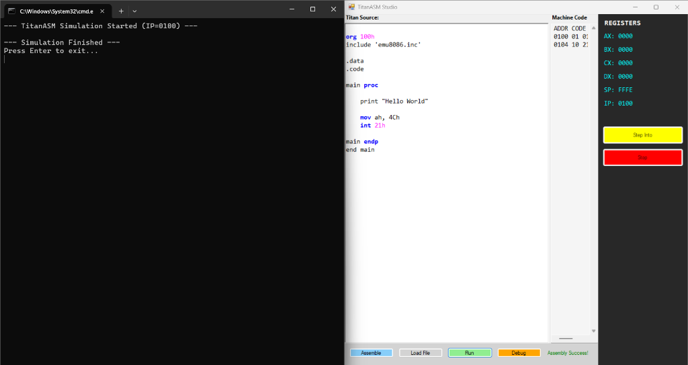
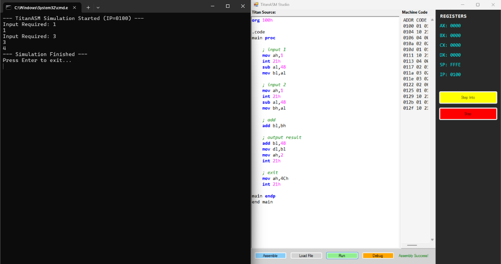

# 🚀 TitanASM: 8086 Development Environment


```text
  _______  _  _                  _      ____   __  __ 
 |__   __|(_)| |                / \    / ___| |  \/  |
    | |    _ | |_   __ _  _ __ / _ \   \___ \ | |\/| |
    | |   | || __| / _` || '_ / ___ \   ___) || |  | |
    |_|   |_| \__| \__,_||_| /_/   \_\ |____/ |_|  |_|
```

TitanASM is a high-performance development environment designed for **Compiler Design** and **Computer Architecture** education. It features a high-speed C++ backend for assembly and simulation, integrated with a clean C# Studio for a seamless development experience.

---

## 🔥 Key Features

| Feature | Description |
| :--- | :--- |
| **Hybrid Core** | C++ Assembler & Virtual Machine with a C# Windows GUI. |
| **Interactive Debugger** | Step-by-step execution with a **Live Register & Stack Viewer**. |
| **Macro Processor** | Support for `INCLUDE` and macro expansions. |
| **emu8086 Ready** | Support for `print`, `printn`, and standard BIOS interrupts. |
| **Machine Code Synced** | Exact 2-digit HEX output for absolute instruction accuracy. |

---

## 📸 Screenshots

### 🌍 Hello World

*Simple, efficient assembly.*

### 🖥️ Mathematics & I/O

*Interactive simulation with real-time console input.*

---

## 🛠️ Instruction Set Support

TitanASM supports a comprehensive subset of the 8086 instruction set:

*   **Move & Math**: `MOV`, `ADD`, `SUB`, `CMP`
*   **Flow Control**: `JMP`, `JZ`, `JNZ`, `CALL`, `RET`
*   **Stack Logic**: `PUSH`, `POP`
*   **Interrupts**: `INT 21h` (AH=1: Input, AH=2: Output, AH=4Ch: Exit)
*   **Directives**: `.data`, `.code`, `.model`, `org`, `db`, `include`

---

## 🚀 Getting Started

### Prerequisites
- **Windows OS**
- **MinGW (g++)**
- **.NET Framework**

### Installation & Run
1. Clone the repository.
2. Build the system (see Build section).
3. Open `bin/TitanASMStudio.exe`.
4. Click **Assemble** then **Run**!

---

## 🏗️ Build from Source

### Backend (Assembler & VM)
```bash
g++ src/backend/*.cpp -I src/backend -o bin/TitanASM.exe
```

### Frontend (User Interface)
```bash
csc /target:winexe /out:bin/TitanASMStudio.exe src/frontend/AssemblerGUI.cs
```

---

## 📜 Example: Basic Arithmetic
```asm
org 100h
.code
main proc
    ; Input Number 1
    mov ah, 1
    int 21h
    sub al, 48
    mov bl, al

    ; Input Number 2
    mov ah, 1
    int 21h
    sub al, 48
    
    ; Add and Print
    add bl, al
    add bl, 48
    mov dl, bl
    mov ah, 2
    int 21h

    mov ah, 4Ch
    int 21h
main endp
end main
```

---

## ⚖️ License
This project is open-source and intended for educational use. 
